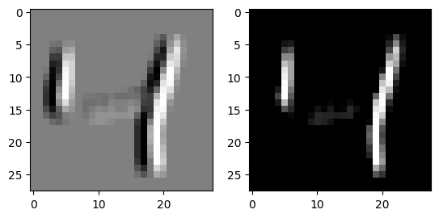

# Exercise 2
### Question 9

a. On one of our machine which has a GPU with 4Gb of memory the epoch run time was around 7.5 seconds. However, as 
    in the case of the first exercise, the first epoch took longer at 10-12s.
    
b. The factor that causes the first epoch to take longer is that Keras supports lazy execution. The model creation 
    and compilation code are not executed until it is absolutely required which is right before the first training 
    epoch. That increased time for the first epoch includes building the TensorFlow computational graph. The other 
    epochs reuse this graph, so the overhead time is not present anymore in them.
    
c. One main difference we can observe is that the decrease in training loss is more gradual. This is explained by 
    the lower learning rate that was chosen. Another thing is that the validation loss is initially high, but it 
    steadily decreases more than it did in the exercise 1 trainings. One explanation would be that the task is harder 
    so it is harder to learn how to generalize well, therefore taking more epochs to achieve this. We also see that 
    sometimes the validation loss increases for one epoch. This can be attributed to a high learning rate, thus instead 
    of going towards the optima point, the weights make the loss jump on the other side of the "loss valley". The reason 
    it actually comes down is that the optimizer used has adaptive learning rate and detects the jump and decreases the 
    learning rate accordingly
    
d. Because this is a more complex task, in which the overall image is extremely important for the detection(not only
    parts of it), the deeper networks perform way better. This is because they have a bigger receptive field, thus they 
    look more at the overall image rather than search for specific close-by features. Another impacting factor is 
    that the exercise2 network has more convolutional layers, meaning that it can extract more features and 
    combinations of features before actually figuring out how to combine them to predict classes(in the fully connected 
    layers).

### Question 10
In this paper the researchers describe their experiments in finding good CNN architectures that also mimic biological neurology.
They have begun by artificially creating high-variation image datasets for object recognition and classification. Then, by using multiple electrode arrays, they measured the IT(Inferior Temporal cortex) neurons' responses to those images from humans. Further, they evaluated thousands of CNNs using high-throughput computational methods. They meausure for these CNNs the categorization performance and how well the outputs of the networks matches up with the outputs of the human-measured IT neurons.
As a result, they have found out that the best performing models on the categorization task were also the ones who predicted the output of the IT neurons the best. However, the models that were selected only on the IT predictibity, did not necessarily have good task performance. This result implies that the performance and IT prediction corellation cannot be explained only by simple mechanical considerations. 
 Further, they have also showed that doing well on categorization tasks does not necessarily mean that the IT prediction will be good. To do this, they have trained models by giving them access to the categorization results during inference and those models actually performed worse at predicting the IT neural responses than the ones that were straight-up learning the categorization task from scratch. 
After finding which model architecture perform better at the categorization task, they analysed what features these models share. It turns out that filter mean and spread, together with the ratio of max-pooling to average-pooling are the model parameters that were the most sensitive and diverse. This hints to the heterogenities observed in higher ventral cortex areas, but it is not enough of a proof for this, so future research still hase to be conducted into this topic. During their experimentation the researchers have also found that the penultimate layer of the best categorization model accurately predicts the input of the IT, the V4 neural structure. This gives a strong evidence that V4 actually is an intermediate layer that contributes in the processing of data until it reaches IT. This result puts a whole new perspective on the way we analyse brains.
The traditional way of analysing brains is from the beginning of the processing flow(eg. retina) to the deeper levels. It assumes that you need to know the first levels to understand the others. This paper, in light of its experimental results, argues that the reverse is also true. It proposes that we should also focus on understanding the deeper levels, because the lower level brain structures have to be made in such a way that they support the computation in the deeper levels. Therefore, if we would also focus on the deeper layers, it might give as valuable insights into how the lower layers from the cognitive path work.


# Execise 2

### Question 11

For the following code the following initation is performed:
```python
import numpy as np
from keras.datasets import mnist
from matplotlib import pyplot
from matplotlib import image

(train_X, train_y), (test_X, test_y) = mnist.load_data()
```

```python
def apply_kernels(img, kernels: list):
  # Kernels should be an list of Np.arrays, representing a list of filters.
  # It is assumed that all kernels are of the same size
  # Kernel can be 2d if the image is also 2d. Otherwise it should be the same size.

  image_y = img.shape[0]
  image_x = img.shape[1]
  if (2 in img.shape):
    image_z = img.shape[2]
  else:
    image_z = 1
    img.shape = (image_y, image_x, image_z)

  kernel = kernels[0] # take the first kernel as a reference

  kernel_y = kernel.shape[0]
  kernel_x = kernel.shape[1]
  if (2 in img.shape):
    kernel_z = kernel.shape[2]
  else:
    kernel_z = 1
      # resize all 2d kernels to 3d
    for kernel in kernels: 
      kernel.shape = (kernel_y, kernel_x, kernel_z)

  # Create an empty image to store the output
  outs = [np.zeros((image_y, image_x)) for i in range(len(kernels))]

  # Create padding around the image for edge pixels where the kernel cannot be applied
  padded_image = np.pad(img, ((int(np.floor(kernel_y / 2)), int(np.floor(kernel_y / 2)) ), (int(np.floor(kernel_x / 2)), int(np.floor(kernel_x / 2))), (int(np.floor(kernel_z / 2)), int(np.floor(kernel_z / 2)))), 'edge')


  # Loop through every given kernel, and pixel of the image
  for (k, kernel) in enumerate(kernels):
    for y in range(image_y):
      for x in range(image_x):
        # Get the current region of interest
        roi = padded_image[y:y + kernel_y, x:x + kernel_x]
        # Perform element-wise multiplication between the ROI and the kernel, then sum the matrix
        outs[k][y, x] = np.sum(roi * kernel)

  return outs

input_img = train_X[2] # sample image from mnist dataset
kernel_1 = np.array([[1, 0, -1], [1, 0, -1], [1, 0, -1]])
kernel_2 = np.array([[1, 1, 1], [0, 0, 0], [-1, -1, -1]])
convolution_outputs = apply_kernels(input_img, [kernel_1, kernel_2])
fig, axs = pyplot.subplots(1, 3)
axs[0].imshow(input_img, cmap=pyplot.get_cmap('gray'))
axs[1].imshow(convolution_outputs[0], cmap=pyplot.get_cmap('gray'))
axs[2].imshow(convolution_outputs[1], cmap=pyplot.get_cmap('gray'))
pyplot.show()

```

![Orignal image next to the result of appying kernel_1 and kernel_2 respectifly] (plots/ex2-q11.png)

### Question 12

```python
def relu(img):
  return np.maximum(img, 0)

relu_out = relu(convolution_outputs[0])
fig, axs = pyplot.subplots(1, 2)
axs[0].imshow(convolution_outputs[0], cmap=pyplot.get_cmap('gray'))
axs[1].imshow(relu_out, cmap=pyplot.get_cmap('gray'))
pyplot.show()
```



### Question 13
*Write a simple function that achieves max pooling.*

```python
def maxpool(input, size):
  in_y, in_x = input.shape

  pool_y = size[0]
  pool_x = size[1]

  if (in_y % pool_y != 0 or in_x % pool_x != 0):
    # pad the input image if it is not divisible by the pool size
    input = np.pad(input, ((0, pool_y - (in_y % pool_y)), (0, pool_x - (in_x % pool_x))), 'edge')
  
  in_y, in_x = input.shape

  out = input.reshape((in_y // pool_y, pool_y, in_x // pool_x, pool_x)).max(axis=(1, 3))


  return out

start = relu_out
pool_out = maxpool(start, (2, 2))
fig, axs = pyplot.subplots(1, 2)
axs[0].imshow(start, cmap=pyplot.get_cmap('gray'))
axs[1].imshow(pool_out, cmap=pyplot.get_cmap('gray'))
pyplot.show()
```


### Question 14
```python
def normalize(input):
  # normalize to input to a standard deviation 1 and mean 0
  return (input - np.mean(input)) / np.std(input)

normalized = normalize(pool_out)
fig, axs = pyplot.subplots(1, 2)
axs[0].hist(pool_out.flatten(), bins=100)
axs[1].hist(normalized.flatten(), bins=100)
pyplot.show()
```

The following plot shows the histogram of the original image and the normalized image.
[Histogram of the original image and the normalized image] (plots/ex2-q14.png)

### Question 15
Expecptions are added to the folowing code to make sure that the input and output sizes are correct. A second argument weights is added to represented the weights of the connections in the fully connected layer.

```python
def fullyConnected(input, weights, outputNodes):
  input = input.flatten()
  if len(input) != weights.shape[1]:
    raise Exception("Input and weights must be the same size")
  if weights.shape[0] != outputNodes:
    raise Exception("Weights and outputNodes must be the same size")
  output = np.zeros(outputNodes)
  for n in range(0, outputNodes):
    output[n] = np.sum(input * weights[n])
  return output


fc_out = fullyConnected(np.array([1, 2, 3]), np.array([[1, 2, 3], [4, 5, 6]]), 2)
print(fc_out) # [14. 32.]
```


### Question 16

```python
def softmax(input):
  return np.exp(input) / np.sum(np.exp(input), axis=0)

softmax(fc_out) # array([1.52299795e-08, 9.99999985e-01])
```
