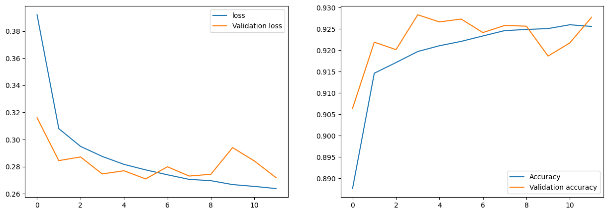
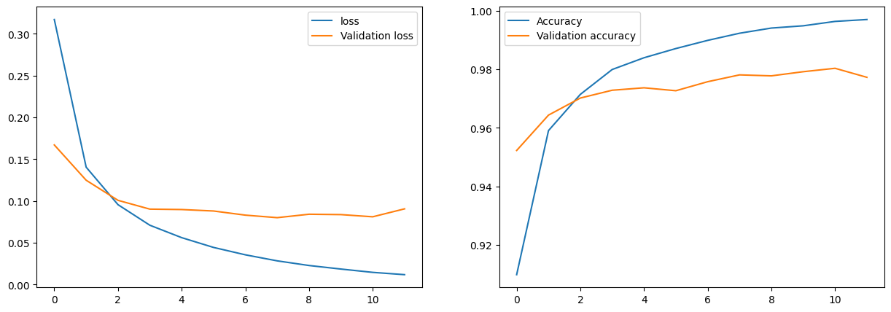
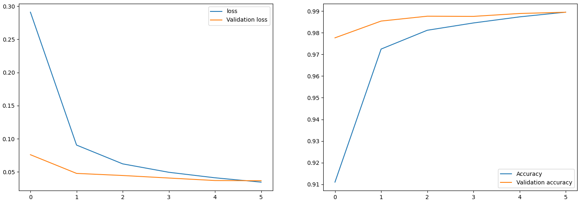
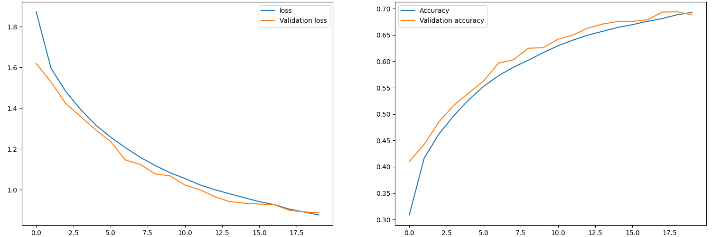
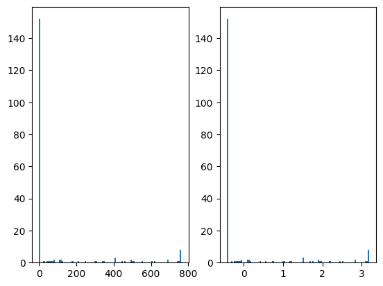

# Exercise 1

## Question 1
Automatic recognition of hand-written numbers can be useful in many applications. For example, in the banking sector, it can be used to read parts of the Dutch IBAN numbers, reference codes, or other digits that are presented on handwritten forms. In the postal sector, it can be used to read the postal code and house number on an envelope. In the education sector, it can be used to read the student numbers on test papers

## Question 2
The accuracy on the training set increases with each epoch, while the accuracy on the validation set's consistent increase in accuracy stops after the 3th epoch. This tells us that the model might be overfitting the training set and that it might not be generalising well. This means the model might be recognising properties unique to an image in the training data rather than the digit it should be trying to detect. 

Plots:


## Question 3
In the assignment, we found an accuracy of 92,46% on the test set. For considering just one number this accuracy is sufficient in some use cases, but if we take one of the examples for *question one* we have use cases where multiple numbers need to be recognised for the use case (e.g. the IBAN number, or postal code). Assuming that the test-set and its accuracy is a good representation of the numbers in the actual use case the odds of it having all four numbers correctly is 0,9246^4 = 0,7308. This would result in too high of an error rate for the postal sector. For the banking sector, this error rate is even higher than an IBAN has 10 digits, so the probability of labelling all numbers correctly is 0,9246 ^ 10 = 0,4566. This results in too high of an error rate.

## Question 4
Linear activation only allows for the multiplication of the input signals with weights from a node, and summing these multiplications of all the inputs (w1 * x1 + w2 * x2 + ...). This means another (mathematical) function on the input of a node is not possible. One interesting property is that the first derivative of these functions is always a constant. This entails that the changing of an input by a certain amount always results in the same increment on the output. By only using linear activation, the activation function of a node can not be a sigmoid, tanh, or ReLu function for example. This limits the possible computations this model can perform.

## Question 5
Just like in the previous model the accuracy keeps increasing on the training set. However, in this model, the accuracy only stops increasing after the 10th set on the validation set. This tells us that the model is not overfitting the training set as much and as fast as the previous model. This means that the model is generalising better.



## Question 6
An accuracy of 98.96% was found for this model. For digit recognition such as house numbers, this is most likely sufficient. However, if we repeat the calculations from question three we find that the expected accuracy of correctly reading a zip code is 0,9896^4 = 0,9590 which is significantly better than the previous model. This would still mean 5% of postal codes are read incorrectly, which is assumably still not enough for a production-scale application. For IBANs with 10 digits, the expected probability would be 0,9896^10 = 0,9007. This is again better than the previous model, but would still result in a high error rate for a production-scale application. Human validation would still be required for almost all use cases where multiple numbers need to be read.



## Question 7

Overfitting happens when the model gets optimized to run as best as possible on the train dataset, but it does 
    not generalize well. This can be easily seen in the loss curves as a training loss that is far lower than the 
    validation loss. On a higher level, we can say that the model learns by heart the correct answers for the training 
    labels, but this makes it useless when new data is presented. This is exactly what happened before adding dropout to 
    the model. We can clearly see that although the training loss was decreasing (proof that the model was predicting 
    the training examples better and better), the validation loss mostly stayed the same. This clearly indicates that 
    the model was not trying to recognize digits ut just memorize the training examples.


Dropout is a technique used to prevent overfitting. It involves randomly ignoring(aka 'dropping out') a number of 
    layer outputs throughout the network. This can be controlled by giving the probability of dropping the output of a 
    node(same for every node). Dropout corrects overfitting in a few ways. Firstly, it reduces the number of node outputs 
    that are used during training, thus decreasing the model's ability to straight up learn the training examples by 
    heart. Secondly, because some nodes are deactivated randomly throughout the training process, this makes the model 
    more robust by forcing it to keep important information in each node, so that if a few nodes disappear, the rest of 
    them still are able to do a good job in predicting. And it turns out that actually making nodes look at only the 
    important features of the last layer is a good way to make them look for features that help in generalizing on 
    new examples.

## Question 8
a. On one of our machines, the first epoch takes 5 seconds, while the others take 3 seconds to complete.
    

b. Now, after adding dropout, we almost see the perfect loss curve. Both the training and the validation loss are 
    decreasing and they seem to get closer and closer. This indicates that the model focuses on the right features and 
    is trying to generalize on the detection task it has to do. Given that the validation and training loss do not 
    actually meet and plateau their decrease around the same value, we would recommend to train for a 1-2 more epochs in 
    order to get a better model, but this is not the point of the exercise.
    

c. If we train for 8 epochs and let the model reach its full potential, then we see an improvement of around 1% on 
    the test dataset (it varies because the starting weights are not set, but chosen random as it is the keras default).
    Also we see far less of an overfitting tendency that before using dropout. Both of these are proofs that the model 
     actually generalizes better.


# Exercise 2
Plot of loss and accuracy of the model:

## Question 9

a. On one of our machines which has a GPU with 4Gb of memory the epoch run time was around 7.5 seconds. However, as 
    in the case of the first exercise, the first epoch took longer at 10-12s.
    
b. The factor that causes the first epoch to take longer is that Keras supports lazy execution. The model creation 
    and compilation code are not executed until it is absolutely required which is right before the first training 
    epoch. That increased time for the first epoch includes building the TensorFlow computational graph. The other 
    epochs reuse this graph, so the overhead time is not present anymore in them.
    
c. One main difference we can observe is that the decrease in training loss is more gradual. This is explained by 
    the lower learning rate that was chosen. Another thing is that the validation loss is initially high, but it 
    steadily decreases more than it did in the exercise 1 trainings. One explanation would be that the task is harder 
    so it is harder to learn how to generalize well, therefore taking more epochs to achieve this. We also see that 
    sometimes the validation loss increases for one epoch. This can be attributed to a high learning rate, thus instead 
    of going towards the optima point, the weights make the loss jump on the other side of the "loss valley". The reason 
    it actually comes down is that the optimizer used has an adaptive learning rate and detects the jump and decreases the 
    learning rate accordingly
    
d. Because this is a more complex task, in which the overall image is extremely important for the detection(not only
    parts of it), the deeper networks perform way better. This is because they have a bigger receptive field, thus they 
    look more at the overall image rather than search for specific close-by features. Another impacting factor is 
    that the exercise 2 network has more convolutional layers, meaning that it can extract more features and 
    combinations of features before actually figuring out how to combine them to predict classes(in the fully connected 
    layers).

## Question 10
In this paper, the researchers describe their experiments in finding good CNN architectures that also mimic biological neurology.
They have begun by artificially creating high-variation image datasets for object recognition and classification. Then, by using multiple electrode arrays, they measured the IT(Inferior Temporal cortex) neurons' responses to those images from humans. Further, they evaluated thousands of CNNs using high-throughput computational methods. They measure for these CNNs the categorization performance and how well the outputs of the networks match up with the outputs of the human-measured IT neurons.
As a result, they found out that the best-performing models on the categorization task were also the ones that predicted the output of the IT neurons the best. However, the models that were selected only on the IT predictability, did not necessarily have good task performance. This result implies that the performance and IT prediction correlation cannot be explained only by simple mechanical considerations. 
 Further, they have also shown that doing well on categorization tasks does not necessarily mean that the IT prediction will be good. To do this, they have trained models by giving them access to the categorization results during inference and those models actually performed worse at predicting the IT neural responses than the ones that were straight-up learning the categorization task from scratch. 
After finding which model architecture performs better at the categorization task, they analysed what features these models share. It turns out that filter's mean and spread, together with the ratio of max-pooling to average-pooling are the model parameters that were the most sensitive and diverse. This hints at the heterogeneities observed in higher ventral cortex areas, but it is not enough of a proof for this, so future research still has to be conducted on this topic. During their experimentation, the researchers have also found that the penultimate layer of the best categorization model accurately predicts the input of the IT, the V4 neural structure. This gives strong evidence that V4 actually is an intermediate layer that contributes to the processing of data until it reaches IT. This result puts a whole new perspective on the way we analyse brains.
The traditional way of analysing brains is from the beginning of the processing flow(eg. retina) to the deeper levels. It assumes that you need to know the first levels to understand the others. This paper, in light of its experimental results, argues that the reverse is also true. It proposes that we should also focus on understanding the deeper levels because the lower-level brain structures have to be made in such a way that they support the computation at the deeper levels. Therefore, if we would also focus on the deeper layers, it might give as valuable insights into how the lower layers of the cognitive path work.


# Execise 2

For all the code samples that will follow, first the following initiation is performed:
```python
import numpy as np
from keras.datasets import mnist
from matplotlib import pyplot
from matplotlib import image

(train_X, train_y), (test_X, test_y) = mnist.load_data()
```

## Question 11

```python
def apply_kernels(img, kernels: list):
  # Kernels should be an list of Np.arrays, representing a list of filters.
  # It is assumed that all kernels are of the same size
  # Kernel can be 2d if the image is also 2d. Otherwise it should be the same size.

  image_y = img.shape[0]
  image_x = img.shape[1]
  if (2 in img.shape):
    image_z = img.shape[2]
  else:
    image_z = 1
    img.shape = (image_y, image_x, image_z)

  kernel = kernels[0] # take the first kernel as a reference

  kernel_y = kernel.shape[0]
  kernel_x = kernel.shape[1]
  if (2 in img.shape):
    kernel_z = kernel.shape[2]
  else:
    kernel_z = 1
      # resize all 2d kernels to 3d
    for kernel in kernels: 
      kernel.shape = (kernel_y, kernel_x, kernel_z)

  # Create an empty image to store the output
  outs = [np.zeros((image_y, image_x)) for i in range(len(kernels))]

  # Create padding around the image for edge pixels where the kernel cannot be applied
  padded_image = np.pad(img, ((int(np.floor(kernel_y / 2)), int(np.floor(kernel_y / 2)) ), (int(np.floor(kernel_x / 2)), int(np.floor(kernel_x / 2))), (int(np.floor(kernel_z / 2)), int(np.floor(kernel_z / 2)))), 'edge')


  # Loop through every given kernel, and pixel of the image
  for (k, kernel) in enumerate(kernels):
    for y in range(image_y):
      for x in range(image_x):
        # Get the current region of interest
        roi = padded_image[y:y + kernel_y, x:x + kernel_x]
        # Perform element-wise multiplication between the ROI and the kernel, then sum the matrix
        outs[k][y, x] = np.sum(roi * kernel)

  return outs

input_img = train_X[2] # sample image from mnist dataset
kernel_1 = np.array([[1, 0, -1], [1, 0, -1], [1, 0, -1]])
kernel_2 = np.array([[1, 1, 1], [0, 0, 0], [-1, -1, -1]])
convolution_outputs = apply_kernels(input_img, [kernel_1, kernel_2])
fig, axs = pyplot.subplots(1, 3)
axs[0].imshow(input_img, cmap=pyplot.get_cmap('gray'))
axs[1].imshow(convolution_outputs[0], cmap=pyplot.get_cmap('gray'))
axs[2].imshow(convolution_outputs[1], cmap=pyplot.get_cmap('gray'))
pyplot.show()

```

![Orignal image next to the result of appying kernel_1 and kernel_2 respectifly] (plots/ex2-q11.png)

## Question 12

```python
def relu(img):
  return np.maximum(img, 0)

relu_out = relu(convolution_outputs[0])
fig, axs = pyplot.subplots(1, 2)
axs[0].imshow(convolution_outputs[0], cmap=pyplot.get_cmap('gray'))
axs[1].imshow(relu_out, cmap=pyplot.get_cmap('gray'))
pyplot.show()
```


## Question 13
*Write a simple function that achieves max pooling.*

```python
def maxpool(input, size):
  in_y, in_x = input.shape

  pool_y = size[0]
  pool_x = size[1]

  if (in_y % pool_y != 0 or in_x % pool_x != 0):
    # pad the input image if it is not divisible by the pool size
    input = np.pad(input, ((0, pool_y - (in_y % pool_y)), (0, pool_x - (in_x % pool_x))), 'edge')
  
  in_y, in_x = input.shape

  out = input.reshape((in_y // pool_y, pool_y, in_x // pool_x, pool_x)).max(axis=(1, 3))


  return out

start = relu_out
pool_out = maxpool(start, (2, 2))
fig, axs = pyplot.subplots(1, 2)
axs[0].imshow(start, cmap=pyplot.get_cmap('gray'))
axs[1].imshow(pool_out, cmap=pyplot.get_cmap('gray'))
pyplot.show()
```


## Question 14
```python
def normalize(input):
  # normalize to input to a standard deviation 1 and mean 0
  return (input - np.mean(input)) / np.std(input)

normalized = normalize(pool_out)
fig, axs = pyplot.subplots(1, 2)
axs[0].hist(pool_out.flatten(), bins=100)
axs[1].hist(normalized.flatten(), bins=100)
pyplot.show()
```

The following plot shows the histogram of the original image and the normalized image.


## Question 15
Expecptions are added to the folowing code to make sure that the input and output sizes are correct. A second argument weights is added to represented the weights of the connections in the fully connected layer.

```python
def fullyConnected(input, weights, outputNodes):
  input = input.flatten()
  if len(input) != weights.shape[1]:
    raise Exception("Input and weights must be the same size")
  if weights.shape[0] != outputNodes:
    raise Exception("Weights and outputNodes must be the same size")
  output = np.zeros(outputNodes)
  for n in range(0, outputNodes):
    output[n] = np.sum(input * weights[n])
  return output


fc_out = fullyConnected(np.array([1, 2, 3]), np.array([[1, 2, 3], [4, 5, 6]]), 2)
print(fc_out) # [14. 32.]
```


## Question 16

```python
def softmax(input):
  return np.exp(input) / np.sum(np.exp(input), axis=0)

softmax(fc_out) # array([1.52299795e-08, 9.99999985e-01])
```

# Exercise 3

## Question 17

For ease of explanation let's focus on a network with two input features and two nodes in each hidden layer. After passing and input example through the network, we get a prediction. From this prediction and a ground truth we can compute the prediction error. The function that computes this error is also called a cost function. Now, we know how bad we are doing overall. In order to improve our predictions, the only variables we can change are the weights inside the network. So, we want to somehow increase or decrease each weight in order to lower the cost function. Given the 2d example, we can imagine the graph of the cost function as a map with mountains, valleys, etc. We are at a certain point and want to get as low as possible, but we do not know in which way "down" is. The derivative of a function is the slope of the tangent to the graph of the function. So, if we were to compute the derivative of the cost function for a variable, that result, by telling us in which way the graph slopes, would tell us if if we should increase or decrease the value of that variable in order to lower the cost function. The slope gives us two pieces of information. The sign of the slope tells us in which direction we should go, while the value of the slope tells us how abrupt the graph is, thus giving us an idea of how much we should advance with our adjustment. So, in order to know how to adjust the weights, we start from the back, from the final cost function result. Then we compute the derivative of each of the weights that directly contributed to the computation of the final prediction. Theese weights will be the ones from the nodes in the last layer. Now we know how to adjust these weights for a better prediction based on measuring how much they influenced the final result error. So, the error was propagated from the final pint to the last set of weights. But theese weights were also computed based on the weights in the layer before them. Because now we know with cow much the last layer weights contribute to the final error, we can do the derivative trick again and find out how much the weights in the layer before the final one contribute to the final error. This goes on from the back of the network(where it starts) to the beginning and in the process, the contribution to the error of each weight is computed. Then with a simple adjustment, we get a better performing network. We repeat these steps until the cost does not decrease anymore and at that point we can say that we reached an optima. Wether if it is local or global and how to escape the local ones and set the learning rate is a discussion for another time.
